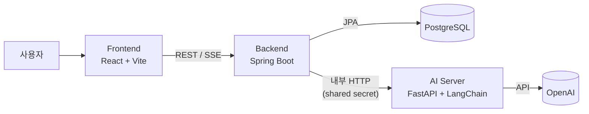

# 속삭 (soksak)

> AI 캐릭터와 대화하는 캐릭터-챗 웹 서비스
> *A character-chat web service — hold conversations with AI characters.*

<!-- 배포했다면 아래 줄의 주석을 풀고 링크를 채우세요 -->
<!-- 🔗 **라이브 데모:** https://your-demo-url · 🎬 **데모 영상:** https://... -->

<p>
  
  
  
  
  
</p>

---

## 📸 스크린샷

> 🚧 **자리 표시** — 아래 예시처럼 `docs/screenshots/` 에 이미지를 넣고 주석을 해제하세요.

<!--
| 캐릭터 목록 | 채팅 |
|---|---|
|  |  |
-->

<!-- GIF/영상 데모 예시:

-->

| 캐릭터 목록 | 채팅 |
|:---:|:---:|
| *(이미지 예정)* | *(이미지 예정)* |

---

## 한눈에 보기

사용자가 AI 캐릭터를 직접 만들고, 그 캐릭터와 실시간으로 대화하는 서비스입니다.
캐릭터 설정(성격·말투·첫 인사말), **로어북**(세계관 설정), **유저 페르소나**를 조합해
프롬프트를 구성하고, 응답은 **SSE 스트리밍**으로 실시간 출력됩니다.

핵심은 **웹/애플리케이션 계층과 LLM 파이프라인을 물리적으로 분리한 3-tier 구조**입니다.
Spring Boot 백엔드는 사용자·캐릭터·영속성·인증을 책임지고, LLM 대화 파이프라인은
독립된 FastAPI + LangChain 서비스로 분리해 상태 없이(stateless) 동작합니다.

---

## 아키텍처



**왜 백엔드와 AI 서버를 나눴는가**

- **관심사 분리** — 웹 계층(트랜잭션·인증·CRUD)과 LLM 파이프라인(프롬프트 조립·모델 호출)은
  변경 주기와 배포 리듬이 다르다. 프롬프트를 손볼 때 백엔드를 재배포할 필요가 없다.
- **Stateless AI 서버** — AI 서버는 대화를 저장하지 않는다. 요청마다 백엔드가 조립한
  프롬프트 설정(모드, 히스토리, 페르소나 등)을 통째로 받아 응답만 반환한다.
  덕분에 수평 확장이 자유롭고, 백엔드가 유일한 진실 공급원(source of truth)이 된다.
- **독립적 기술 스택** — LLM 생태계는 Python이 풍부하다. 파이프라인만 Python으로 두고
  나머지는 JVM 생태계의 강점(타입 안정성·트랜잭션·테스트)을 그대로 쓴다.

---

## 주요 기능

- **인증** — JWT 기반 로그인, **Refresh Token 로테이션 + 재사용 탐지**(토큰 탈취 대응)
- **캐릭터** — 생성/수정/삭제, 장르 태그·검색·정렬, 좋아요, 대화수 집계, 첫 인삿말
- **로어북(Lorebook)** — 캐릭터별 세계관 설정 항목 CRUD, 개별 on/off 토글
- **유저 페르소나** — 사용자가 대화 시 사용할 페르소나 관리, 기본 페르소나 지정
- **채팅** — 채팅방 CRUD, 메시지 편집/재생성, **SSE 스트리밍** 응답, 대화 요약
- **프롬프트 조립** — `{{user}}`/`{{char}}` 치환, 스포일러 접기 토글, RP/글쓰기 모드

---

## 기술 스택

| 계층 | 기술 |
|---|---|
| **Frontend** | React 18, React Router, Vite |
| **Backend** | Java 17, Spring Boot 3.5, Spring Web, Spring Security, Spring Data JPA, Validation, JJWT |
| **AI Server** | Python 3.11+, FastAPI, LangChain, langchain-openai |
| **Database** | PostgreSQL 16 |
| **인프라/기타** | Docker Compose, spring-dotenv, JUnit 5 · H2(테스트) |

---

## 엔지니어링 하이라이트

이 프로젝트에서 특히 신경 쓴 백엔드 설계 지점들입니다.

- **AI 서버 의존성을 끊고 개발 가능한 설계 (`StubChatAiClient`)**
  채팅 AI 클라이언트를 인터페이스로 추상화해, AI 서버 없이도 백엔드를 실행·테스트할 수 있습니다.
  실제 호출은 `ChatAiServerClient`, 로컬/테스트는 `StubChatAiClient` 로 교체됩니다.

- **SSE 실시간 스트리밍**
  백엔드가 AI 서버의 SSE 스트림을 읽어 프론트로 중계(`/messages/stream`)합니다.
  응답을 통째로 기다리지 않고 토큰 단위로 화면에 출력됩니다.

- **E2E 테스트 커버리지**
  인증, 캐릭터 CRUD, 채팅방 CRUD, 메시지에 대한 E2E 테스트를 작성했습니다.

---

## API 요약

인증·유저

| Method | Path | 설명 |
|---|---|---|
| POST | `/signup` | 회원가입 |
| GET | `/me` | 내 정보 조회 |
| POST | `/auth/login` | 로그인 (JWT 발급) |
| POST | `/auth/reissue` | Access 토큰 재발급 (refresh 로테이션) |
| POST | `/auth/logout` | 로그아웃 |

캐릭터·로어북

| Method | Path | 설명 |
|---|---|---|
| GET/POST | `/characters` | 목록·검색 / 생성 |
| GET/PUT/DELETE | `/characters/{id}` | 조회 / 수정 / 삭제 |
| GET | `/characters/me`, `/characters/liked` | 내 캐릭터 / 좋아요한 캐릭터 |
| POST/DELETE | `/characters/{id}/like` | 좋아요 / 취소 |
| CRUD | `/characters/{characterId}/lores` | 로어북 항목 (+ `PATCH /{id}/enabled`) |

페르소나·채팅

| Method | Path | 설명 |
|---|---|---|
| CRUD | `/user-personas` | 유저 페르소나 (+ `PATCH /{id}/default`) |
| CRUD | `/chatrooms` | 채팅방 (+ `PATCH /{id}/config`) |
| POST/GET | `/chatrooms/{roomId}/messages` | 메시지 전송 / 목록 |
| POST | `/chatrooms/{roomId}/messages/stream` | 스트리밍 응답 |
| POST | `/chatrooms/{roomId}/messages/regenerate` | 응답 재생성 |

내부(백엔드 → AI 서버, shared secret 인증): `POST /chat`, `POST /chat/stream`, `POST /summarize`

---

## 로컬 실행

**사전 준비**

```bash
# 저장소 클론
git clone https://github.com/yoojaegon/soksak.git
cd soksak

# 환경변수 설정
cp .env.example .env        # 루트: DB_PASSWORD, JWT_SECRET_KEY 채우기
cp ai-server/.env.example ai-server/.env   # AI 서버: OPENAI_API_KEY 채우기
```

실행 순서: **Postgres → Backend → AI Server → Frontend**

```bash
# 1) PostgreSQL (Docker) — 루트에서
docker compose up -d

# 2) Backend → http://localhost:8080
cd backend && ./gradlew bootRun

# 3) AI Server → http://localhost:8000
cd ai-server && uv run uvicorn app.main:app --port 8000

# 4) Frontend → http://localhost:5173
cd frontend && npm install && npm run dev
```

> 프론트엔드는 Vite dev proxy로 백엔드와 통신하므로 개발 시 별도 CORS 설정이 필요 없습니다.
> AI 서버를 띄우지 않고 백엔드만 돌리려면 채팅 클라이언트를 `StubChatAiClient` 로 전환하면 됩니다.

---

## 프로젝트 구조

```
soksak/
├── backend/     # Spring Boot — REST API, 인증, 영속성
├── ai-server/   # FastAPI + LangChain — LLM 대화 파이프라인 (stateless)
├── frontend/    # React + Vite — 웹 UI
└── docker-compose.yml
```

---

## 트러블슈팅

통합 코드 리뷰에서 발견해 수정한, 백엔드에서 특히 까다로웠던 문제들입니다.

### 1. 리프레시 토큰 보안 & 단일 세션 정합성

- **문제** — ① 액세스/리프레시 토큰이 구분되지 않아 **리프레시 토큰으로도 일반 API를 호출**할 수 있었다.
  ② 재발급이 동시에 여러 번 일어나면 토큰 회전과 겹쳐 로그인 세션이 도중에 풀렸다.
  ③ 로그인할 때마다 refresh 행이 무한히 쌓였다.
- **원인** — 토큰에 용도(type) 정보가 없었고, 재발급 갱신이 원자적이지 않아 경합에 취약했으며,
  refresh 저장에 유니크 제약이 없었다.
- **해결**
  - 토큰에 `type`(access/refresh) 클레임을 추가 → **필터는 access만 인증 처리**, 재발급은 **refresh만 허용**
  - 재발급을 원자적 `UPDATE ... WHERE refresh_token = :old` 로 바꾸고,
    **갱신된 행이 1이 아니면 재사용/경합으로 간주해 차단**(재사용 탐지)
  - `user_id` UNIQUE + 로그인 시 기존 토큰 회전 → **유저당 refresh 1행(단일 세션)**,
    로그아웃도 그 1행 폐기로 세션 전체가 종료됨

### 2. 외부 AI 호출을 트랜잭션 밖으로 — 유저 메시지 유실 방지

- **문제** — AI 응답 생성이 실패하면 **방금 저장한 사용자 메시지까지 롤백되어 사라졌다.**
- **원인** — 메시지 저장과 AI 서버 호출이 같은 `@Transactional` 안에 묶여,
  외부 호출 실패가 DB 트랜잭션 전체를 되돌렸다.
- **해결** — 트랜잭션 경계를 분리했다. **사용자 메시지를 먼저 커밋**(`ChatTxService`)한 뒤
  → **AI 호출은 트랜잭션 밖에서** 수행하고 → 성공 시 별도 트랜잭션으로 AI 메시지를 저장한다.
  서비스 메서드는 두 트랜잭션을 지휘만 하고, 조회는 join fetch로 detached lazy 로딩을 막았다.

### 3. DB 제약 위반이 전부 "409 중복"으로 뭉개지던 문제

- **문제** — 서로 다른 제약 위반이 모두 중복(409)으로 응답돼 실제 원인을 알 수 없었고,
  **연관 데이터가 있는 캐릭터를 삭제하면 FK 위반이 잘못된 409로** 나갔다.
- **원인** — `GlobalExceptionHandler` 가 모든 `DataIntegrityViolationException` 을
  일괄로 `DUPLICATE_VALUE(409)` 에 매핑했다.
- **해결** — PostgreSQL **SQLState로 분기**했다 — 유니크(23505)만 409,
  NOT NULL(23502)·FK(23503)는 각각 적절한 코드로. 캐릭터 삭제는 연관 메시지/채팅방을
  **먼저 정리**해 FK 위반 자체를 없앴다.

### 4. 같은 방 동시 전송 경합

- **문제** — 한 채팅방에 전송 요청이 동시에 들어오면 메시지 순서·상태가 꼬일 수 있었다.
- **원인** — 방 단위의 동시성 제어가 없었다.
- **해결** — `roomId` 별 `ReentrantLock` 의 `tryLock` 으로 처리해, 이미 처리 중이면
  `ROOM_BUSY(409)` 로 거절한다(단일 인스턴스 가정, 인메모리 락).

---

## 앞으로 (Roadmap)

<!-- 실제 계획에 맞게 다듬으세요 -->
- [ ] 배포 (프론트/백엔드/AI 서버 + 관리형 PostgreSQL)
- [ ] 대화 히스토리 요약을 활용한 장기 기억(long-term memory)
- [ ] 캐릭터 공유/탐색 UX 개선
