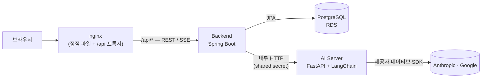

# 속삭 (soksak)

> AI 캐릭터와 대화하는 캐릭터-챗 웹 서비스
> *A character-chat web service — hold conversations with AI characters.*

<p>
  
  
  
  
  
</p>

---

## 1. 프로젝트 소개

사용자가 AI 캐릭터를 만들고, 그 캐릭터와 실시간으로 대화하는 서비스입니다.

캐릭터 설정·**로어북**(세계관)·**유저 페르소나**·**장기 기억(요약)**을 조합해 프롬프트를 만들고,
응답은 **SSE 스트리밍**으로 흘려보냅니다. 대화할 때마다 **마디**(소모 재화)를 차감하며,
방마다 모델과 추론 강도를 고를 수 있습니다.

웹/애플리케이션 계층(**Spring Boot**)과 LLM 파이프라인(**FastAPI + LangChain**)을 별도 서버로 나눈 구조이며,
이 문서는 백엔드를 중심으로 설명합니다.

<!-- TODO 데모 움짤: 채팅 답변이 토큰 단위로 흘러나오는 장면 (10초 안팎, 폭 800px, 5MB 이하)
     파일을 docs/images/demo-chat.gif 에 넣고 아래 주석을 풀 것. 녹화 시 주소창(서버 IP)은 영역에서 뺀다.
<p align="center">
  
</p>
-->

---

## 2. 주요 기능

| 영역 | 기능 |
|---|---|
| **인증** | JWT access/refresh, refresh 로테이션 + 재사용 탐지, 유저당 세션 1개, 만료 토큰 정리 스케줄러 |
| **계정** | 회원가입(가입 보너스 마디 + 기본 페르소나 자동 생성), 내 정보 조회, 닉네임 수정, 비밀번호 변경(변경 시 세션 폐기) |
| **캐릭터** | CRUD, 장르 태그·키워드 검색·정렬(페이징), 좋아요, 대화수 집계 |
| **로어북** | 캐릭터별 세계관 항목 CRUD, 항목별 on/off, 키워드 매칭으로 필요한 항목만 프롬프트에 주입 |
| **유저 페르소나** | 대화에서 쓸 "나" 설정, 기본 페르소나 지정, 마지막 1개 삭제 방지 |
| **채팅** | 채팅방 CRUD, SSE 스트리밍, 메시지 수정·재생성·특정 지점 이후 되감기 |
| **장기 기억** | 20턴마다 요약 조각을 쌓고 토큰 예산 안에서 골라 주입, 사용자가 직접 편집 가능 |
| **방별 설정** | 모델, 추론(thinking) 레벨, 글쓰기 모드·스포일러 접기 토글 |
| **마디(크레딧)** | 모델별 계수만큼 메시지당 차감, 원장 기록, AI 실패 시 환불, 충전 묶음 |
| **이미지 업로드** | 매직바이트로 형식 판별(jpg·png·webp·gif), 5MB 제한 |

---

## 3. 기술 스택

| 영역 | 기술 |
|---|---|
| **Backend** | Java 17, Spring Boot 3.5, Spring Web, Spring Security, Spring Data JPA, Bean Validation, JJWT, Lombok |
| **Database** | PostgreSQL 16 (배포: AWS RDS), H2 (테스트) |
| **AI Server** | Python 3.11+, FastAPI, LangChain, langchain-anthropic, langchain-google-genai |
| **Infra** | Docker Compose, nginx, AWS EC2 + RDS (커스텀 VPC), spring-dotenv |
| **Test** | JUnit 5, Spring Boot Test, MockMvc |

---

## 4. 빠른 시작

### 4-1. 준비물 설치

| 필요한 것 | 용도 |
|---|---|
| **Docker + Docker Compose v2** | 실행 (필수) |
| JDK 17 | 테스트 실행 (선택) |

```bash
git clone https://github.com/yoojaegon/soksak.git
cd soksak
```

### 4-2. 환경변수 파일 만들기

루트의 `.env` **한 파일**을 docker compose가 읽어 모든 컨테이너에 값을 넣어 줍니다.

```bash
cp .env.example .env
```

### 4-3. `.env` 값 채우기

| 키 | 필수 | 설명 |
|---|:---:|---|
| `DB_PASSWORD` | ✅ | Postgres 비밀번호. 예: `openssl rand -hex 32` |
| `JWT_SECRET_KEY` | ✅ | JWT 서명 키(HS256). 예: `openssl rand -base64 32` |
| `INTERNAL_AUTH_SECRET` | ✅ | 백엔드 ↔ AI 서버 내부 인증 비밀값. 예: `openssl rand -hex 32` |
| `ANTHROPIC_API_KEY` | ✅ | Claude 모델 호출 + 요약 토큰 수 세기 |
| `GOOGLE_API_KEY` | ✅ | Gemini 모델 호출. 기본 채팅 모델이 Gemini라 비우면 AI 서버가 기동에 실패합니다 |
| `DB_USERNAME` | | 기본 `postgres` |
| `DB_URL` | | **로컬에선 비워 두세요**(기본값이 Postgres 컨테이너를 가리킴). 배포(RDS)에서만 채웁니다 |
| `SUMMARY_MODEL` / `SUMMARY_TIMEOUT` | | 요약 모델·타임아웃. 비우면 코드 기본값 |
| `TOKEN_COUNT_MODEL` | | 토큰 수 세기 기준 모델. 비우면 코드 기본값 |
| `LOG_LEVEL_APP` / `LOG_LEVEL_SQL` | | 로그 레벨. SQL을 보려면 `LOG_LEVEL_SQL=DEBUG` |

### 4-4. 실행

Postgres·백엔드·AI 서버·웹을 한 번에 띄웁니다.

```bash
docker compose --profile local up -d --build
```

### 4-5. 동작 확인

- 브라우저: http://localhost
- API: `curl http://localhost/api/characters`

캐릭터 목록은 비로그인으로도 열리므로, 빈 페이지 JSON(`"content": []`)이 오면 백엔드와 DB가 정상입니다.

> 업로드 이미지와 DB 데이터는 도커 볼륨에 있습니다. `docker compose down -v`는 볼륨까지 지우니 주의하세요.

---

## 5. 폴더 구조

```
soksak/
├── backend/                     # Spring Boot
│   └── src/
│       ├── main/java/com/soksak/soksak/
│       │   ├── auth/            # 로그인·재발급·로그아웃, refresh 토큰, 만료 토큰 정리
│       │   ├── user/            # 회원가입·내 정보·비밀번호
│       │   ├── character/       # 캐릭터, 좋아요(characterLike/)
│       │   ├── lore/            # 로어북
│       │   ├── userPersona/     # 유저 페르소나
│       │   ├── chatRoom/        # 채팅방·방별 설정, 장기 기억 조각(chatSummary/)
│       │   ├── message/         # 전송·스트리밍·재생성·되감기, 트랜잭션 분리(ChatTxService)
│       │   ├── credit/          # 마디 차감·원장·충전
│       │   ├── aiClient/        # AI 서버 클라이언트, 모델 카탈로그, 대화 이력 트리머
│       │   ├── upload/          # 이미지 업로드
│       │   ├── config/          # Security, JWT 필터, traceId 필터, 스트리밍 스레드 풀
│       │   └── common/          # 에러 코드, 전역 예외 처리, 공통 엔티티
│       └── test/                # 단위 · E2E 테스트 (H2)
├── ai-server/                   # FastAPI + LangChain — LLM 파이프라인 (stateless)
│   └── docs/                    # LLM 설정·프롬프트 구조 문서
├── frontend/                    # 웹 UI
├── docker-compose.yml           # 로컬·배포 공용 구성
└── .env.example                 # 환경변수 템플릿
```

---

## 6. 아키텍처 개요


```mermaid
flowchart LR
    U[브라우저] --> NG["nginx<br/>(정적 파일 + /api 프록시)"]
    NG -->|"/api/* — REST / SSE"| BE["Backend<br/>Spring Boot"]
    BE -->|JPA| DB[(PostgreSQL<br/>RDS)]
    BE -->|"내부 HTTP<br/>(shared secret)"| AI["AI Server<br/>FastAPI + LangChain"]
    AI -->|"제공사 네이티브 SDK"| LLM[(Anthropic · Google)]
```

**역할 분담**

- **Backend** — 인증, 사용자·캐릭터·채팅 영속성, 과금, 그리고 "프롬프트에 무엇을 실을지" 고르는 일
  (로어 매칭, 요약 조각 선택, 최근 대화 자르기). 모델 목록·마디 계수·추론 레벨 보정 같은 제품 정책도
  백엔드 `ModelCatalog`가 단일 출처입니다.
- **AI Server** — 아무것도 저장하지 않습니다(stateless). 백엔드가 골라 보낸 재료로 프롬프트를 조립하고
  제공사 SDK를 호출해 응답과 요약만 돌려줍니다. 프롬프트를 고쳐도 백엔드는 다시 배포할 필요가 없습니다.

**채팅 한 번의 흐름** (`POST /chatrooms/{roomId}/messages/stream`)

1. 방 락을 잡습니다 — 같은 방에 이미 생성 중이면 즉시 `409 ROOM_BUSY`.
2. 한 트랜잭션에서 사용자 메시지 저장 + **마디 차감**(조건부 UPDATE 한 번, 영향 행 0이면 `402`).
3. 필요하면 요약을 먼저 갱신하고, 로어·기억·최근 대화를 골라 AI 서버에 요청합니다. 이 호출은 **트랜잭션 밖**이라,
   실패해도 사용자 메시지는 사라지지 않습니다.
4. 받은 토큰을 SSE로 중계하고, 끝나면 별도 트랜잭션으로 답을 저장합니다.
   **브라우저가 중간에 끊겨도 생성은 끝까지 읽어 저장**합니다(다시 들어오면 답이 완성돼 있음).
5. 답이 한 글자도 남지 않은 실패(AI 오류 등)면 차감을 되돌리는 `REFUND` 원장 줄을 쌓습니다.

**설계에서 지킨 것**

- **잔액은 조건부 UPDATE로만** — 읽고-빼고-쓰기는 동시 요청에서 음수가 됩니다. 방 락은 방 단위라
  다른 방 두 개로 동시에 보내는 경우를 못 막으므로, 계정 단위 보호는 이 UPDATE가 맡습니다.
  원장과 잔액은 `SUM(delta) == credit_balance` 불변식을 유지합니다.
- **요청 추적** — 요청마다 traceId를 MDC에 넣고 `X-Trace-Id` 헤더로 돌려줍니다. 스트리밍 스레드 풀이
  제출 시점에 MDC를 복사해 가므로, 스트림 구간 로그도 같은 traceId로 묶입니다.

  <!-- TODO (선택) 같은 traceId로 묶인 채팅 한 번의 로그 캡처: docs/images/trace-log.png
  
  -->
- **배포** — EC2 한 대에서 docker compose로 nginx·backend·ai-server를 띄우고 DB는 RDS(프라이빗 서브넷)를 씁니다.
  외부에 열리는 건 nginx(80)뿐이고, backend·ai-server는 compose 네트워크 안에서 서비스 이름으로만 닿습니다.
  로컬과 배포는 같은 compose 파일을 쓰며 차이는 `--profile local`과 `.env` 값뿐입니다.

LLM 설정은 [`ai-server/docs/llm-config.md`](ai-server/docs/llm-config.md),
프롬프트 구조는 [`ai-server/docs/prompt-architecture.md`](ai-server/docs/prompt-architecture.md)에 있습니다.

---

## 7. 엔드포인트 예제

모든 경로는 `/api` 아래에 있습니다. 아래 예제는 전체 실행(`http://localhost`) 기준입니다.

```bash
BASE=http://localhost/api
```

### 회원가입 → 로그인

```bash
curl -X POST $BASE/users -H 'Content-Type: application/json' -d '{
  "email": "tester@example.com", "loginId": "tester", "nickname": "테스터",
  "password": "test1234!", "age": 25, "gender": "OTHER"
}'
# 201 → {"id":1,"email":"tester@example.com","loginId":"tester","nickname":"테스터","createdAt":"..."}

curl -X POST $BASE/auth/login -H 'Content-Type: application/json' \
  -d '{"loginId": "tester", "password": "test1234!"}'
# 200 → {"accessToken":"eyJ...","refreshToken":"eyJ..."}

TOKEN=eyJ...    # 위 accessToken
```

### 캐릭터 만들기 → 채팅방 열기

```bash
curl -X POST $BASE/characters -H "Authorization: Bearer $TOKEN" -H 'Content-Type: application/json' -d '{
  "name": "하린", "description": "비 오는 날의 서점 주인",
  "persona": "조용하고 다정하다. 책 이야기가 나오면 말이 많아진다.",
  "greeting": "어서 오세요. 비 피하러 오셨어요?",
  "tags": ["DAILY", "ROMANCE"]
}'
# 201 → {"id":1,"characterName":"하린",...,"tags":["DAILY","ROMANCE"]}

curl -X POST $BASE/chatrooms -H "Authorization: Bearer $TOKEN" -H 'Content-Type: application/json' \
  -d '{"characterId": 1}'
# 201 → {"id":1,"title":"...","characterId":1,"model":null,"thinkingLevel":null,...}
```

### 메시지 보내기 (SSE 스트리밍)

```bash
curl -N -X POST $BASE/chatrooms/1/messages/stream \
  -H "Authorization: Bearer $TOKEN" -H 'Content-Type: application/json' \
  -d '{"content": "네, 갑자기 쏟아지네요."}'
```

```text
event:token
data:{"content":"창밖을"}

event:token
data:{"content":" 보던 하린이"}

event:done
data:{"id":3,"role":"ASSISTANT","content":"창밖을 보던 하린이 ...","createdAt":"..."}
```

<!-- TODO (선택) 위 curl -N 이 토큰을 흘려보내는 터미널 움짤: docs/images/sse-curl.gif

-->

실패하면 `event:error` / `data:{"code":"AI_UNAVAILABLE","message":"..."}`로 끝납니다.
마디가 부족하면 스트림을 열기 전에 `402 INSUFFICIENT_CREDIT`이 일반 JSON으로 돌아옵니다.

### 방 설정 · 마디

```bash
# 모델 목록 (모델별로 고를 수 있는 추론 레벨 포함)
curl $BASE/models -H "Authorization: Bearer $TOKEN"

# 이 방의 추론 레벨 변경 (off · low · medium · high)
curl -X PATCH $BASE/chatrooms/1/thinking -H "Authorization: Bearer $TOKEN" \
  -H 'Content-Type: application/json' -d '{"thinkingLevel": "medium"}'

# 잔액 조회 / 충전 (수량이 아니라 묶음 id로만 받는다: small · medium · large)
curl $BASE/credits/me -H "Authorization: Bearer $TOKEN"
curl -X POST $BASE/credits/topup -H "Authorization: Bearer $TOKEN" \
  -H 'Content-Type: application/json' -d '{"packId": "medium"}'
```

### 전체 엔드포인트

<details>
<summary>펼치기</summary>

| Method | Path | 설명 |
|---|---|---|
| POST | `/users` | 회원가입 (비로그인 허용) |
| GET · PATCH | `/users/me` | 내 정보 조회 · 닉네임 수정 |
| PATCH | `/users/me/password` | 비밀번호 변경 (세션 폐기) |
| POST | `/auth/login` · `/auth/reissue` · `/auth/logout` | 로그인 · access 재발급(refresh 로테이션) · 로그아웃 |
| GET · POST | `/characters` | 목록(`q`, `tag`, `page`, `sort`, 비로그인 허용) · 생성 |
| GET · PUT · DELETE | `/characters/{id}` | 조회 · 수정 · 삭제 |
| GET | `/characters/me` · `/characters/liked` | 내 캐릭터 · 좋아요한 캐릭터 |
| POST · DELETE | `/characters/{id}/like` | 좋아요 · 취소 |
| CRUD | `/characters/{characterId}/lores` | 로어북 (+ `PATCH /{id}/enabled`) |
| CRUD | `/user-personas` | 유저 페르소나 (+ `PATCH /{id}/default`) |
| POST | `/uploads/images` | 이미지 업로드 (multipart) |
| CRUD | `/chatrooms` | 채팅방 |
| PATCH | `/chatrooms/{id}/model` · `/thinking` · `/config` | 모델 · 추론 레벨 · 프롬프트 토글 |
| GET · PATCH | `/chatrooms/{id}/summary` | 장기 기억 조회 · 직접 편집 |
| GET · POST | `/chatrooms/{roomId}/messages` | 메시지 목록 · 전송(비스트리밍) |
| POST | `/chatrooms/{roomId}/messages/stream` | 전송 (SSE) |
| POST | `/chatrooms/{roomId}/messages/regenerate` · `/regenerate/stream` | 마지막 응답 재생성 |
| PUT | `/chatrooms/{roomId}/messages/{messageId}` | 메시지 수정 |
| DELETE | `/chatrooms/{roomId}/messages/{messageId}/after` | 이 지점 이후 되감기 |
| GET | `/models` | 모델 카탈로그 |
| GET | `/credits/me` · `/credits/packs` | 잔액 · 충전 묶음 목록 |
| POST | `/credits/topup` | 충전 |

내부(백엔드 → AI 서버, shared secret 인증): `POST /chat`, `POST /chat/stream`, `POST /summarize`

</details>

---

## 10. 테스트

`test` 프로필에서 H2 인메모리 DB와 `StubChatAiClient`(AI 서버 대역)를 쓰므로, **Postgres·AI 서버·API 키 없이** 돌아갑니다.

```bash
cd backend
./gradlew test                                        # 전체
./gradlew test --tests "*.CreditServiceTest"          # 클래스 하나
```

| 영역 | 테스트 | 무엇을 고정하나 |
|---|---|---|
| 인증 | `AuthReissueE2eTest`, `TokenServiceTest` | 원자적 로테이션, 회전된 옛 refresh 재사용 시 401, refresh 타입만 허용 |
| 캐릭터·로어 | `CharacterCrudE2eTest`, `CharacterSearchTest`, `LoreServiceTest` | 소유권, 검색·태그 필터, 로어 키워드 매칭 |
| 채팅 | `ChatRoomCrudE2eTest`, `MessageE2eTest` | 전송·수정·재생성·되감기, 남의 방 접근 차단, 요약 조각 정리 |
| 기억·프롬프트 | `SummarySelectorTest`, `HistoryTrimmerTest`, `ModelCatalogThinkingTest` | 토큰 예산 선택, 요약 주기를 덮는 이력 예산, 모델별 추론 레벨 보정 |
| 마디 | `CreditServiceTest`, `CreditChatE2eTest` | 20스레드 동시 차감에도 음수 없음, 402, AI 실패 시 환불, 가입 보너스 |
| 인프라 | `ChatStreamConfigTest` | 스트림 스레드로 MDC(traceId)가 제출 시점에 복사되는지 |
